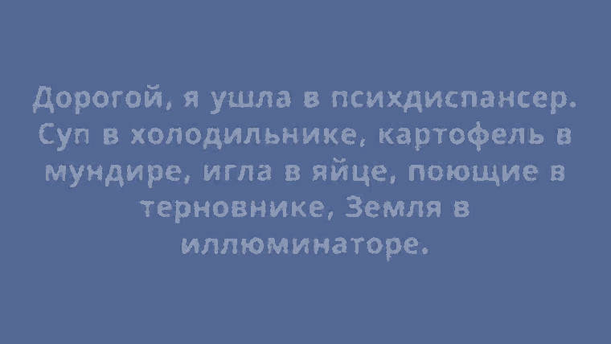

# Проект "ЧТД (ЧеловекоТипыДанных)"

Выполнен в качестве практического задания 12.6 (Модуль 12. Типы данных) на курсе Профессия "Веб-разработчик" от SkillFactory.

***

## Функции

* [x] Разбиение и объединение ФИО (`getPartsFromFullname` и `getFullnameFromParts`)

* [x] Сокращение ФИО (`getShortName`)

* [x] Определение пола по ФИО (`getGenderFromName`)

* [x] Определение гендерного состава аудитории (`getGenderDescription`)

* [x] "Идеальный" подбор пары (`getPerfectPartner`)

***

Обработка строк, космический корабль, арифметика, обработка массивов.

***

### Используемые технологии

* НTML
* CSS
* PHP

***

#### *Дата последнего редактирования: 12.02.2023 г.*
